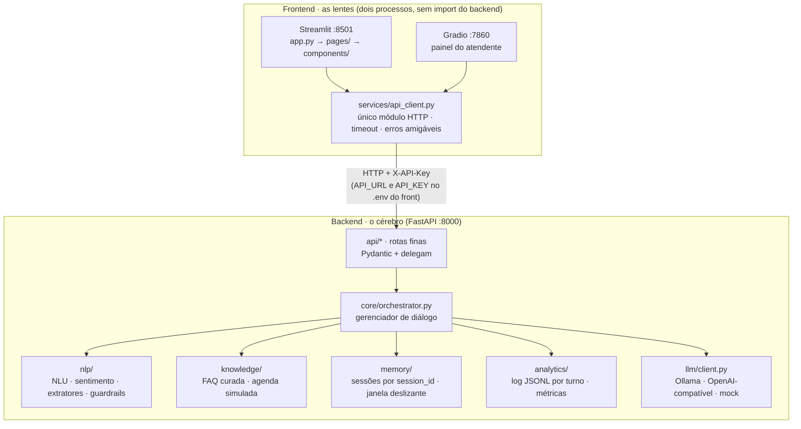
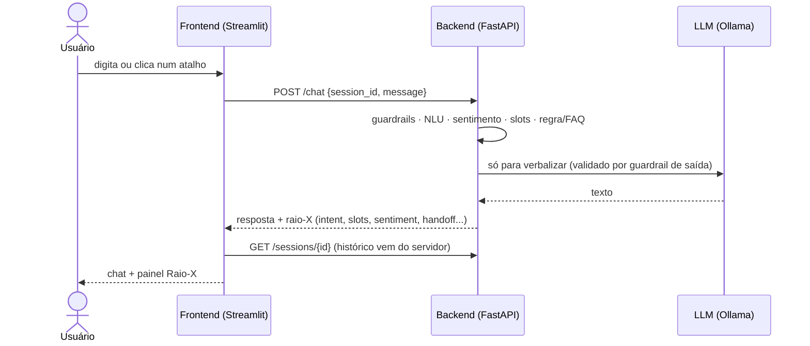

# Prosa Bot — Bot como Serviço

**FIAP · Tecnólogo em IA · Turma 2TIAPF · Checkpoint Integrado de Front-end e PLN**

Assistente **Duda**, da Clínica Veterinária Patas & Cia. O bot mora no **backend** (FastAPI), que concentra NLU, sentimento, slots, memória, FAQ, agenda simulada, guardrails, handoff e analytics. O **frontend** (Streamlit/Gradio) é só uma lente que consome a API por HTTP.

**Sumário:** [1 Integrantes](#1-integrantes) · [2 Caso e bot](#2-caso-e-bot) · [3 Arquitetura](#3-arquitetura) · [4 Tecnologias](#4-tecnologias-e-modelo-de-linguagem) · [5 Como executar](#5-como-executar-passo-a-passo) · [6 Contrato da API](#6-contrato-da-api) · [7 Memória](#7-memória-e-estado) · [8 Regra × LLM](#8-decisões-regra--llm-justificadas) · [9 Resultados](#9-resultados-resumo) · [10 Limitações](#10-limitações-conhecidas) · [11 Divisão](#11-divisão-de-responsabilidades) · [12 IA generativa](#12-declaração-de-uso-de-ia-generativa) · [13 Pastas](#13-estrutura-de-pastas) · [14 Problemas](#14-solução-de-problemas)

### Início rápido (3 terminais)
```powershell
# terminal 1 · backend (porta 8000)
cd backend; python -m venv .venv; .\.venv\Scripts\Activate.ps1
pip install -r requirements.txt; copy .env.example .env      # ollama pull qwen2.5:3b (ou LLM_PROVIDER=mock)
uvicorn app.main:app --reload --port 8000

# terminal 2 · chat Streamlit (porta 8501)
cd frontend; python -m venv .venv; .\.venv\Scripts\Activate.ps1
pip install -r requirements.txt; copy .env.example .env
streamlit run app.py --server.port 8501

# terminal 3 · painel do atendente (porta 7860, opcional)
cd frontend; .\.venv\Scripts\Activate.ps1
pip install -r requirements-atendente.txt; python painel_atendente.py
```
Abra `http://localhost:8501` (chat, raio-X e métricas) e `http://localhost:8000/docs` (API).

**Links da entrega:** repositório: **https://github.com/Tonelli2003/CP-PLN-FRONT-END** · vídeo de demonstração (não listado): **https://youtu.be/HlP2TGTn54w**

## 1. Integrantes
| Nome | RM | Responsabilidade |
|---|---|---|
| Felipe de Oliveira Cabral | RM561720 | Orquestrador e fluxo de agendamento |
| Marcelo Roberto Maso Junior | RM562163 | NLU, sentimento e extratores de slots |
| Augusto Oliveira Codo de Sousa | RM562080 | Guardrails, handoff, cliente do LLM e system prompt |
| Sofia Bueris Netto de Souza | RM565818 | API FastAPI, schemas Pydantic, autenticação, memória/sessões e testes do backend |
| Gabriel Tonelli Avelino Dos Santos | RM564705 | Frontend Streamlit: chat, raio-X, métricas, cliente HTTP e testes do front |
| Vinícius Adrian Siqueira de Oliveira | RM564962 | Analytics, painel do atendente (Gradio), documentação, prints e vídeo |

## 2. Caso e bot
**Domínio:** clínica veterinária (dados 100% fictícios). **Persona:** Duda, assistente virtual (IA), acolhedora, calma e objetiva, que nunca finge ser humana.

- **Fluxo transacional:** agendar consulta, coletando nome do tutor, nome do pet, data, horário e e-mail, com validação e agenda simulada em JSON.
- **FAQ curada:** 7 ou mais itens em `backend/data/faq.json` (endereço, valores, horários, vacinas, pagamento, primeira consulta, remarcar/cancelar…).
- **Handoff:** emergência, luto/eutanásia, reclamação, pedido do usuário, frustração e falha repetida, com resumo estruturado.

Detalhes (faz/não faz, happy path, fallback, handoff): [`docs/ficha_do_bot.md`](docs/ficha_do_bot.md).

## 3. Arquitetura


**Um turno, passo a passo** (a tela só envia a mensagem e desenha o que volta):

Se amanhã a Prosa trocar o Streamlit por um app ou pelo WhatsApp, nenhuma linha do bot muda: a nova lente só precisa do contrato da API (seção 6). O front nunca importa código do backend e nunca chama o LLM.

**Pipeline de um turno:** dado sensível → prompt injection → intenção + sentimento → (handoff?) → guardrail de tema → fluxo/FAQ → voz (LLM validado ou template) → log. Os turnos são **atômicos** (trabalha numa cópia da sessão e só grava se tudo der certo).

## 4. Tecnologias e modelo de linguagem
Backend: Python · FastAPI · Pydantic · Uvicorn · pytest · Ollama. Frontend: Streamlit (chat, raio-X e métricas) · Gradio (painel do atendente) · httpx · python-dotenv.

**Modelo: `qwen2.5:3b` via Ollama (local).**
- **Custo:** zero, sem chave de API e sem custo para quem corrige.
- **Latência observada** (hardware: **PENDENTE — informar CPU/GPU/RAM**): média ≈ 3,4 s e p95 ≈ 8,5 s por turno (turnos de template ≈ 0 ms; turnos com LLM ≈ 4,5–9,2 s; a 1ª chamada, que carrega o modelo, levou 13,5 s).
- **Qualidade em português:** texto fluente para frases curtas, mas um modelo de 3B omite ou inventa fatos: em 34% das verbalizações (15 de 44) o guardrail de saída rejeitou o texto e usou o texto-base, e houve falhas pontuais que passaram (uma data errada, uma frase repetida). Por isso o LLM só verbaliza e **nunca decide**.

**Versões:** cada projeto tem o seu `requirements.txt`, com faixas validadas pela suíte nas versões mínima e recente (detalhes nos comentários dos arquivos): backend FastAPI ≥ 0.110 e Pydantic ≥ 2.6; frontend Streamlit ≥ 1.55; painel do atendente Gradio ≥ 6.0. Python 3.11+.

Trocar de provedor = mudar o `.env` (`LLM_PROVIDER=ollama | openai_compat | mock`), sem tocar no bot.

## 5. Como executar (passo a passo)

### 5.1 Pré-requisitos
Python 3.11+ e [Ollama](https://ollama.com). No Windows, o Ollama já inicia em segundo plano após a instalação (ícone na bandeja): **não é preciso** rodar `ollama serve`. No Linux/macOS, rode `ollama serve` em um terminal.
```bash
ollama pull qwen2.5:3b
```

### 5.2 Backend (terminal 1, porta 8000)
```powershell
cd backend
python -m venv .venv
.\.venv\Scripts\Activate.ps1          # Linux/macOS: source .venv/bin/activate
pip install -r requirements.txt       # para os testes: pip install -r requirements-dev.txt
copy .env.example .env                # Linux/macOS: cp .env.example .env  (defina API_KEY)
uvicorn app.main:app --reload --port 8000
```
Confira `http://localhost:8000/health` (deve mostrar `provider: ollama` e `available: true`) e a documentação interativa em `http://localhost:8000/docs`. Rode o uvicorn **dentro de `backend/`**.

Sem Ollama: `LLM_PROVIDER=mock` no `.env` (tudo funciona, respostas = texto-base) ou `LLM_VERBALIZE=false`.

### 5.3 Frontend (terminal 2, porta 8501)
Projeto independente: seu próprio `requirements.txt`, ambiente e processo. Com o backend já no ar:
```powershell
cd frontend
python -m venv .venv
.\.venv\Scripts\Activate.ps1          # Linux/macOS: source .venv/bin/activate
pip install -r requirements.txt
copy .env.example .env                # Linux/macOS: cp .env.example .env
streamlit run app.py --server.port 8501
```
O `.env` do front traz `API_URL=http://localhost:8000` e `API_KEY` (a **mesma** do `.env` do backend; o `.env.example` já vem igual ao do backend). A chave fica no servidor do Streamlit e nunca vai para o navegador. Abra `http://localhost:8501`.

**Segunda lente, opcional (terminal 3, porta 7860): painel do atendente**
```powershell
cd frontend
pip install -r requirements-atendente.txt     # com o mesmo ambiente do front
python painel_atendente.py
```
Mostra a fila de `GET /handoffs` (urgentes primeiro), o resumo estruturado e a transcrição de cada conversa. Para ver algo, gere um handoff no chat (ex.: "Isso é um absurdo, ninguém me responde!").

### 5.4 Testes automatizados (sem precisar de LLM)
```powershell
cd backend
pip install -r requirements-dev.txt
python -m pytest -q                   # 49 testes do backend
cd ..\frontend
pip install -r requirements-dev.txt
python -m pytest                      # 34 testes do front (cliente HTTP, telas, painel); +4 de integração com o backend no ar
```
Os 4 testes de `frontend/tests/test_integracao_api_real.py` (inclusive a tela inteira contra a API real) só rodam com o backend no ar; senão são pulados e funcionam com `LLM_PROVIDER=mock`.

### 5.5 Gerar as evidências e as métricas
Com o backend rodando, na raiz do projeto:
```powershell
python backend/scripts/run_scenarios.py --base-url http://localhost:8000 --api-key SUA_CHAVE
```
Roda T1–T8 + 16 conversas, grava `docs/evidencias/transcricoes.md` e `metrics_snapshot.json` e atualiza as tabelas de `docs/metricas.md`.

## 6. Contrato da API
Todas as rotas, exceto `/health`, exigem o header `X-API-Key`. Documentação completa, com descrição de cada rota, em `/docs`.

| Método e rota | Função |
|---|---|
| `GET /health` | status, provedor/modelo do LLM, disponibilidade (público) |
| `POST /sessions` | cria sessão → `{session_id, greeting, capabilities}` |
| `POST /chat` `{session_id, message}` | resposta + raio-X: `intent, intent_confidence, slots, sentiment, fallback, fallback_type, handoff{active,reason,priority,protocol,summary}, turn, latency_ms, source, llm_used, guardrail_events, flow` |
| `GET /sessions/{id}` | histórico, slots, status (ativa/transferida/encerrada), handoff, agendamento |
| `DELETE /sessions/{id}` | apaga a sessão e anonimiza o log (LGPD) |
| `GET /metrics` | métricas calculadas do log |
| `GET /handoffs` | fila de transferências (urgentes primeiro) |
| `POST /feedback` `{session_id, rating 1-5, comment?}` | CSAT |

**Erros:** `404` `sessao_nao_encontrada` · `422` validação Pydantic · `401` `api_key_invalida` · `503` `llm_indisponivel` (corpo `{"detail":{"code","message"}}` e header `Retry-After`; a mensagem está pronta para o front exibir).

### 6.1 Como o frontend consome o contrato
| Rota | Método de `services/api_client.py` | Onde aparece na tela |
|---|---|---|
| `GET /health` | `health()` | status da API e do modelo na barra lateral |
| `POST /sessions` | `create_session()` | abertura do chat e botão "Nova conversa" |
| `POST /chat` | `send_message()` (timeout longo, por causa do LLM) | chat e painel Raio-X |
| `GET /sessions/{id}` | `get_session()` | histórico, slots, handoff e aba "Estado no servidor" |
| `GET /metrics` | `get_metrics()` | página Métricas |
| `GET /handoffs` | `list_handoffs()` | painel do atendente (Gradio) |
| `POST /feedback` | `send_feedback()` | nota CSAT na barra lateral |
| `DELETE /sessions/{id}` | `delete_session()` | "Apagar esta conversa (LGPD)" |

- **Estado:** o front guarda só o `session_id` (em `st.session_state` e na URL, `?sid=`, então um F5 não perde a conversa). O histórico é relido do servidor a cada tela; o único cache local é o raio-X de exibição (intenção, sentimento, latência) de cada turno.
- **Erros amigáveis (sem traceback):** API fora do ar, timeout, `401` (chave), `404` (sessão expirada: abre outra), `422` e `503` (mensagem pronta do backend). Com a API desligada o chat é substituído por um aviso com o botão "Tentar novamente".
- **Interface:** tema próprio, atalhos de início de conversa (cada um envia uma mensagem real à API), Raio-X em cards com progresso dos slots e métricas em abas, com a definição de cada indicador.
- **Raio-X:** intenção, sentimento, fallback, fluxo, origem da resposta (template/LLM/guardrail), latência e guardrails do turno; slots e handoff (com resumo) vindos do servidor.
- **T8 (prova da lente):** a barra lateral mostra o `session_id` e o botão do `/docs`. Envie `POST /chat` pelo `/docs` com esse id e clique em "Atualizar" na aba "Estado no servidor": a mensagem aparece na tela.

## 7. Memória e estado
- **Servidor:** histórico e slots por `session_id`, persistidos em JSON (sobrevivem a reinício). O front guarda apenas o `session_id`.
- **Janela deslizante de N = 8 turnos** (16 mensagens). Justificativa: cabe em `num_ctx=4096` (~700 tokens de prompt + ~150 de estado + ~800 de histórico) e cobre uma conversa de agendamento inteira.
- **O que sai da janela não se perde:** slots, horários oferecidos e ações realizadas ficam no estado e são reinjetados a cada turno (teste com janela de 1 turno: `test_t3_memoria_com_janela_pequena`).

## 8. Decisões regra × LLM (justificadas)
1. **Slots e validação são código, não LLM.** Data (31/02, passada, domingo/feriado, > 60 dias), horário, e-mail e nomes exigem exatidão, e o LLM de 3B erra. Os slots ficam numa estrutura de dados e aparecem no raio-X; reserva atômica na agenda impede dupla marcação.
2. **A FAQ é consulta por regra; o LLM só reescreve o texto curado.** Evita inventar serviço ou preço (T6). Um guardrail de saída compara o texto do LLM com o texto-base e, se faltar ou sobrar fato, descarta o LLM (observado: 15 rejeições em 44 verbalizações; o guardrail ainda não cobre datas `dd/mm` nem frases repetidas, ver `docs/metricas.md`).
3. **Emergência, handoff, fallback e erros de validação são templates.** São os turnos críticos e precisam funcionar mesmo com o LLM fora do ar (demonstrado no vídeo, derrubando o Ollama).
4. **Intenção e sentimento por regras/léxico** (auditáveis e determinísticos). O sentimento muda o comportamento: tom de acolhimento e antecipação do handoff.
5. **Pergunta fora da base no meio do agendamento é decidida por código.** Se o usuário pergunta algo que a FAQ não cobre enquanto o bot espera um dado (ex.: "Vocês fazem ultrassom?" na etapa do e-mail), o orquestrador registra `fora_da_base`, admite que não sabe, passa o telefone da recepção e repete a pergunta pendente, sem perder os slots e sem tratar a frase como dado inválido.

## 9. Resultados (resumo)
Detalhes em [`docs/metricas.md`](docs/metricas.md) e [`docs/evidencias/`](docs/evidencias/).

| Métrica (23 conversas, 88 turnos, LLM real) | Valor |
|---|---:|
| Contenção / Resolução | 69,6% / 43,5% |
| Fallback / Handoff | 8,0% / 30,4% |
| Mensagens por conversa | 3,83 |
| Latência média / p95 | 3,4 s / 8,5 s |
| Respostas do LLM rejeitadas pelo guardrail | 15 de 44 (34,1%) |

## 10. Limitações conhecidas
- NLU por regras: gírias e erros fortes de digitação caem em fallback; sentimento por léxico não capta ironia.
- FAQ por palavras-chave, sem busca semântica (`buscar_faq` está isolada para trocar por RAG depois).
- Modelo de 3B omite fatos e, raramente, passa pelo guardrail com data errada ou frase repetida (ver `docs/metricas.md`); a latência pesa em CPU.
- Sessões e logs em arquivos (não é arquitetura para produção em escala).
- Amostra de métricas pequena e roteirizada; notas de CSAT **simuladas**.
- Dados fictícios.

## 11. Divisão de responsabilidades
Veja a tabela da seção 1. Em resumo:

- **Felipe:** `core/orchestrator.py`, `core/responses.py`, `knowledge/agenda.py` (fluxo de agendamento e agenda simulada).
- **Marcelo:** `nlp/nlu.py`, `nlp/sentiment.py`, `nlp/extractors.py` (intenção, sentimento e validação de slots).
- **Augusto:** `nlp/guardrails.py`, `core/handoff.py`, `llm/client.py`, `prompts/system_prompt.md` (guardrails, handoff e acesso ao LLM).
- **Sofia:** `api/*`, `schemas.py`, `deps.py`, `memory/` e `backend/tests/` (rotas, autenticação, sessões e testes).
- **Gabriel:** `frontend/` (chat, raio-X, métricas, `services/api_client.py` e `frontend/tests/`).
- **Vinícius:** `analytics/`, `scripts/`, `painel_atendente.py`, `docs/`, prints e vídeo.

## 12. Declaração de uso de IA generativa
Este projeto foi desenvolvido com apoio de IA generativa: o **Claude (Anthropic)**, usado por chat. Declaramos abaixo onde ela foi usada, o que o grupo fez e o que veio de bibliotecas e modelos prontos.

### 12.1 Onde a IA foi usada
| Parte | Uso da IA |
|---|---|
| **Backend** (`backend/app/`) | Geração da primeira versão do código: API e rotas, schemas Pydantic, autenticação por `X-API-Key`, orquestrador, NLU, sentimento, extratores de slots, guardrails, handoff, memória, cliente do LLM e analytics. |
| **Frontend** (`frontend/`) | Geração da primeira versão do Streamlit (chat, raio-X, métricas), do painel do atendente em Gradio e do `services/api_client.py`. |
| **Testes** | Geração dos testes automatizados: 49 no backend (incluindo o roteiro T1–T8) e 38 no frontend (34 unitários e de tela + 4 de integração com a API real). |
| **Documentação** | Primeira versão do README, da ficha do bot, do relatório de métricas, do roteiro do vídeo e do script `run_scenarios.py`. |
| **Revisão final (04/10/2026)** | Conferência do projeto contra o enunciado e correções: pergunta fora da base no meio do agendamento deixou de ser tratada como dado inválido, o exemplo fixo de data da pergunta (`15/10`) foi removido, os prints foram renomeados e a documentação foi ajustada. |

### 12.2 O que o grupo fez
- Definiu o caso (clínica veterinária, dados 100% fictícios), a persona Duda e a divisão de responsabilidades da seção 11.
- Configurou o ambiente (Python e Ollama com `qwen2.5:3b`), executou os testes automatizados e subiu backend, chat e painel do atendente em processos separados.
- Executou os 23 cenários (T1–T8 e 16 variadas) com o **LLM real**, analisou o log por turno (`turns.jsonl`) e examinou os 15 turnos em que o guardrail de saída rejeitou o texto do modelo. Dessa análise saíram o insight e a proposta de melhoria de `docs/metricas.md`.
- Tirou as capturas de tela de `docs/prints/` e gravou o vídeo de demonstração.
- Cada integrante é responsável por explicar os módulos listados na sua linha da seção 1 e o fluxo de um turno (guardrails → NLU e sentimento → regra/FAQ → voz → log).

### 12.3 O que é próprio e o que veio de bibliotecas e modelos prontos
| Origem | O que é |
|---|---|
| **Código do projeto** | Orquestrador, NLU por regras, sentimento por léxico PT (com negação e intensificadores), extratores e validação de slots, agenda simulada, FAQ por regra, guardrails de entrada e de saída, handoff com resumo, janela de memória, log e métricas, e as telas. Nenhum modelo de NLU ou de sentimento pronto é usado. |
| **Bibliotecas** | FastAPI, Pydantic, Uvicorn, httpx, python-dotenv, pytest, Streamlit, Gradio, pandas e Altair. |
| **Modelo pronto** | `qwen2.5:3b`, executado localmente pelo Ollama, usado só para reescrever textos-base já decididos pelo código. |

### 12.4 Limites e verificação
O código gerado por IA foi validado pelos testes automatizados (sem LLM) e pela execução real dos cenários, não apenas por leitura. Mesmo assim, a IA pode errar: o próprio modelo local teve 34% das saídas rejeitadas pelo guardrail e deixou passar uma data errada (ver `docs/metricas.md`). Por isso o LLM só verbaliza e nunca decide.

## 13. Estrutura de pastas
```
prosa-bot/
├── backend/   app/{api,core,nlp,memory,llm,knowledge,analytics}, prompts/system_prompt.md,
│              data/{faq.json,agenda.json}, tests/, scripts/, requirements.txt, .env.example
├── frontend/  app.py (navegação), pages/{chat,metricas}.py, components/{state,sidebar,chat,raio_x,metrics_view,ui}.py,
│              services/api_client.py (único módulo HTTP), config.py, painel_atendente.py (Gradio),
│              tests/, requirements.txt, requirements-atendente.txt, .env.example
├── docs/      ficha_do_bot.md, metricas.md, roteiro_video.md, evidencias/, prints/ (capturas de tela)
└── README.md
```
Os arquivos `.env` (com chaves) **não** devem ser versionados; só os `.env.example` de `backend/` e `frontend/`.

## Capturas de tela
Em [`docs/prints/`](docs/prints/) (índice em `LEIAME.md`): chat com raio-X (`01`), handoff (`02`), página Métricas (`03`), `/docs` da API (`04`), painel do atendente (`05`), front com a API fora do ar (`06`) e execução dos testes do front e do backend (`07` e `08`).

## 14. Solução de problemas
| Sintoma | Causa provável |
|---|---|
| Barra lateral mostra "fora do ar" | backend desligado ou `API_URL` errado no `frontend/.env` |
| "A chave de acesso à API foi recusada" | `API_KEY` do front diferente da do backend |
| Resposta demora ~15 s na 1ª mensagem | o Ollama está carregando o modelo; aumente `API_TIMEOUT_S` se necessário |
| Painel do atendente não abre | instale `requirements-atendente.txt` (exige Gradio ≥ 6) |
| "Estou com dificuldade para responder" (503) | Ollama fora do ar; suba o Ollama ou use `LLM_PROVIDER=mock` |
